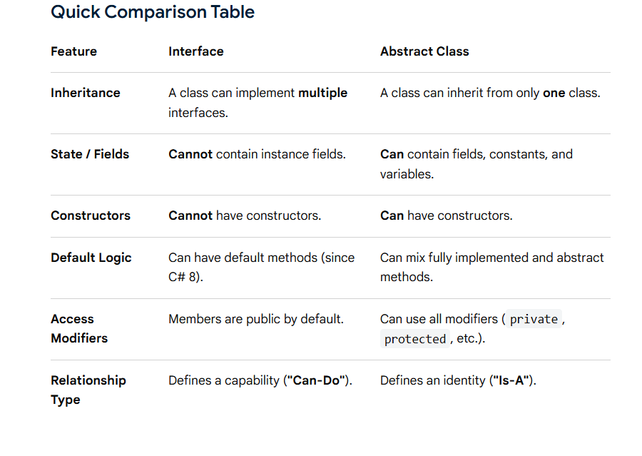

# interface 

`Interface` is a reference type that defines a strict contract or blueprint of behavior that a class or struct must implement.

```c#
interface IAnimal
{
    void MakeSound();
}
```

Any class that implements IAnimal must provide a MakeSound() method.

```c#

class Dog : IAnimal
{
    public void MakeSound()
    {
        Console.WriteLine("Bark");
    }
}
```


### Interface Cannot Normally Be Instantiated

Just like an abstract class, you cannot directly create an interface object

Because an interface defines a contract, not a concrete implementation.

But you can do:
```c#
IAnimal animal = new Dog();
```
This is also an example of polymorphism.


## Multiple Interfaces

This is one of the biggest advantages of interfaces.

C# support multiple inheritance through interfaces

```c#
interface IWalkable
{
    void Walk();
}

interface ISwimmable
{
    void Swim();
}

class Human : IWalkable, ISwimmable
{
    public void Walk()
    {
        Console.WriteLine("Walking");
    }

    public void Swim()
    {
        Console.WriteLine("Swimming");
    }
}
```


## Interface vs Abstract Class

`interfaces` define a strict behavioral contract ("what a class can do"), while `abstract classes` serve as a partially implemented blueprint for a family of related classes ("what a class is").

- Abstract class can contain:

    Fields,
    Constructors,
    Implemented methods,
    Abstract methods,
    Properties
- Interface is primarily defines a contract.


