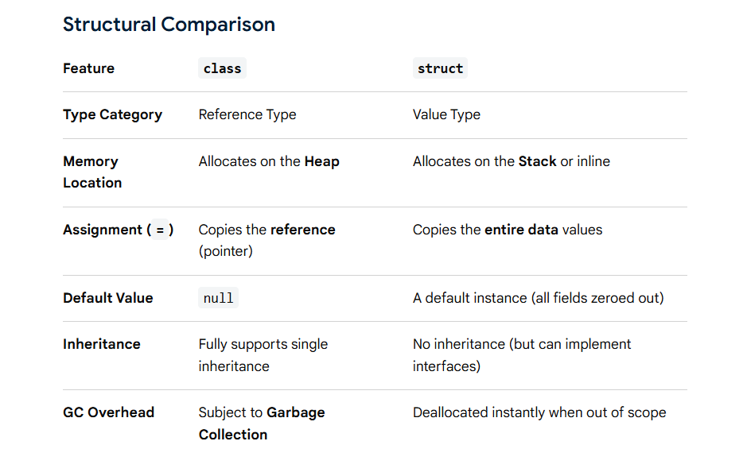

# Struct 

A `struct` (structure) is a `value type` in C# that allows you to group multiple related values into a single type.

It is a user-defined value type.

```c#
struct Point
{
    public int X;
    public int Y;
}

Point p = new Point();

p.X = 10;
p.Y = 20;
```

### Struct is value type

```c#
Point p1 = new Point();

p1.X = 10;
p1.Y = 20;

Point p2 = p1;
```
p2 receives a copy of p1.

```
p1                    p2
┌─────────┐          ┌─────────┐
│ X = 10  │          │ X = 10  │
│ Y = 20  │          │ Y = 20  │
└─────────┘          └─────────┘
    ↑                    ↑
 separate values     separate values
```

## 1. Struct vs Class

The biggest difference is:

```
struct → Value Type
class  → Reference Type
```
<br>



## 2. Struct Can Have Methods

It can contain methods.

```c#
struct Rectangle
{
    public int Width;
    public int Height;

    public int GetArea()
    {
        return Width * Height;
    }
}


Rectangle rectangle = new Rectangle();

rectangle.Width = 10;
rectangle.Height = 5;

Console.WriteLine(rectangle.GetArea());
```

## 3. Struct Can Have Properties

We can use properties just like classes.
```c#
struct Person
{
    public string Name { get; set; }
    public int Age { get; set; }
}
```

## 4. Struct Can Have Constructors

Modern C# allows structs to have constructors.

```c#
struct Point
{
    public int X;
    public int Y;

    public Point(int x, int y)
    {
        X = x;
        Y = y;
    }
}

Point point = new Point(10, 20);

Console.WriteLine(point.X);
Console.WriteLine(point.Y);
```


## 5. Struct Can Implement Interfaces

Struct can implement interfaces.

<b>Note</b> : Struct Cannot Inherit from Another Class or Structs

```c#
interface IPrintable
{
    void Print();
}

struct Invoice : IPrintable
{
    public void Print()
    {
        Console.WriteLine("Printing invoice");
    }
}

Invoice invoice = new Invoice();

invoice.Print();
```


### Structs are generally appropriate for small values that represent a single conceptual value.