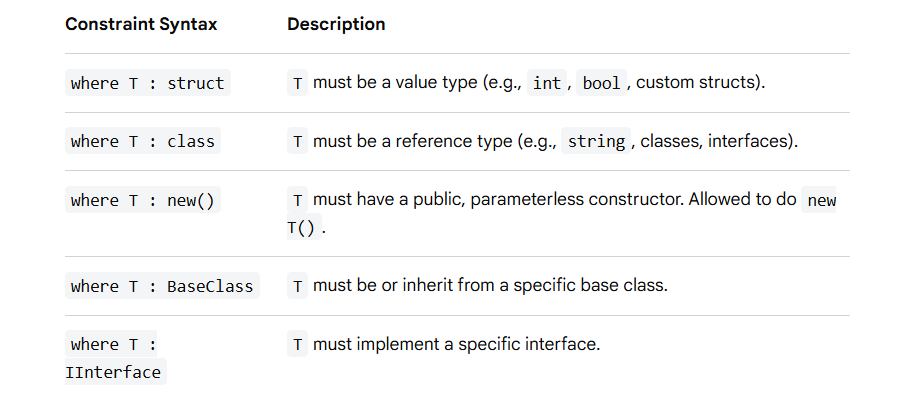

# Generics

`Generics` allow you to write code that works with different data types without rewriting the same code.

Prior to `generics`, handling multiple data types required using the `object` type or duplicating code for every data type. Generics solve these issues by offering three main benefits :

- `Type Safety`: The compiler catches data type mismatches at compile time, eliminating the risk of a runtime `InvalidCastException`.
- `Performance`: Eliminates the processing overhead of boxing (converting a value type to an object) and unboxing (converting it back).
- `Code Reusability`: Write a single logic pipeline once and apply it across integers, strings, or custom domain models

## 1. Generic Classes

A generic class encapsulates logic that is not specific to any particular data type. The symbol T is conventionally used as the type placeholder.

```c#
using System;

// Defining a generic class
public class Box<T>
{
    private T _content;

    public void Pack(T item) => _content = item;
    public T Unpack() => _content;
}

class Program
{
    static void Main()
    {
        // Instantiating with an integer
        Box<int> intBox = new Box<int>();
        intBox.Pack(123);
        int x = intBox.Unpack(); // No casting required!

        // Instantiating with a string
        Box<string> stringBox = new Box<string>();
        stringBox.Pack("Hello Generics");
        string s = stringBox.Unpack();
    }
}
```

## 2. Generic Methods

Methods can declare their own standalone type parameters, even inside a standard, non-generic class.

```c#
public class Utilities
{
    // A generic method that swaps two elements of any type
    public static void Swap<T>(ref T left, ref T right)
    {
        T temp = left;
        left = right;
        right = temp;
    }
}

// Usage:
int a = 5, b = 10;
Utilities.Swap<int>(ref a, ref b); // Type parameter explicitly provided

string first = "world", second = "hello";
Utilities.Swap(ref first, ref second); // Type parameter inferred by compiler!
```


## 3. Generic Constraints (`where`)

By default, an unconstrained `T` can be absolutely anything. We can use the `where` keyword to restrict what types are allowed as generic arguments, which lets you safely access specific features or methods of those types.



```c#
public class Repository<T> where T : class, new()
{
    public T CreateNewInstance()
    {
        // Allowed because of 'new()' constraint
        return new T(); 
    }
}
``` 